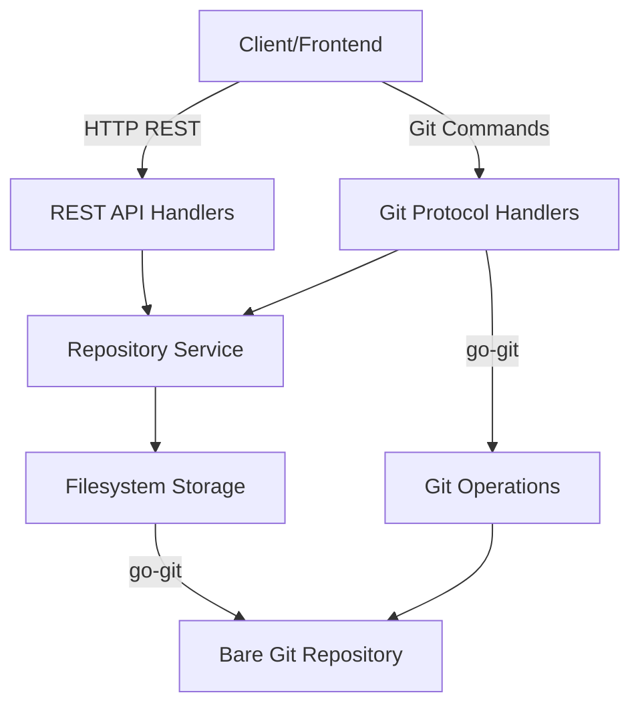

# Git Platform Backend Architecture

## Overview

Build a Go backend that allows creating repositories and handling git push/pull operations over HTTP. The system will use Gin for HTTP routing, go-git for git operations, and implement the git HTTP protocol for remote operations.

## Architecture Components

### Project Structure

```
gitport/
├── cmd/
│   └── server/
│       └── main.go              # Application entry point
├── internal/
│   ├── handlers/
│   │   ├── repo_handler.go      # REST API handlers for repos
│   │   └── git_handler.go       # Git protocol handlers (upload-pack, receive-pack)
│   ├── services/
│   │   └── repo_service.go      # Business logic for repository operations
│   ├── storage/
│   │   └── filesystem.go        # Filesystem-based repository storage
│   └── models/
│       └── repository.go        # Repository data models
├── go.mod
└── README.md
```

### Core Components

#### 1. Repository Storage (`internal/storage/filesystem.go`)

- Store bare git repositories in filesystem (e.g., `repos/{name}.git/`)
- Use go-git to initialize bare repositories
- Provide methods: `CreateRepo(name)`, `GetRepoPath(name)`, `ListRepos()`, `RepoExists(name)`

#### 2. Repository Service (`internal/services/repo_service.go`)

- Business logic layer
- Methods: `CreateRepository(name string) error`, `ListRepositories() ([]Repository, error)`, `GetRepository(name string) (*Repository, error)`

#### 3. REST API Handlers (`internal/handlers/repo_handler.go`)

- `POST /api/repos` - Create new repository
- `GET /api/repos` - List all repositories
- `GET /api/repos/:name` - Get repository details

#### 4. Git Protocol Handlers (`internal/handlers/git_handler.go`)

Implement git HTTP protocol endpoints:

- `GET /repos/:name.git/info/refs?service=git-upload-pack` - For git fetch/clone
- `POST /repos/:name.git/git-upload-pack` - Handle fetch requests
- `GET /repos/:name.git/info/refs?service=git-receive-pack` - For git push
- `POST /repos/:name.git/git-receive-pack` - Handle push requests

These endpoints allow standard git commands:

- `git clone http://server/repos/name.git`
- `git push http://server/repos/name.git main`
- `git pull http://server/repos/name.git main`

#### 5. Models (`internal/models/repository.go`)

- `Repository` struct with fields: `Name`, `Path`, `CreatedAt`, `IsPublic`

### Data Flow



### Implementation Details

**Git Protocol Implementation:**

- Use go-git's `plumbing/transport/http` capabilities
- For `info/refs`: Return refs in git protocol format
- For `upload-pack`/`receive-pack`: Handle packfile negotiation using go-git's plumbing layer
- Alternatively, use go-git's server capabilities or implement minimal protocol handlers

**Repository Storage:**

- All repos stored as bare repositories (no working directory)
- Path structure: `{baseDir}/repos/{name}.git/`
- Use `git.Init` with `&git.PlainInitOptions{Bare: true}`

**Configuration:**

- Base directory for repos (configurable via env var or config file)
- Server port (default 8080)
- CORS settings for frontend integration

### Dependencies

- `github.com/gin-gonic/gin` - HTTP framework
- `github.com/go-git/go-git/v5` - Git operations
- `github.com/go-git/go-git/v5/plumbing/transport/http` - Git HTTP transport

### API Endpoints Summary

**REST API:**

- `POST /api/repos` - `{"name": "my-repo"}` → Create repository
- `GET /api/repos` → List all repositories
- `GET /api/repos/:name` → Get repository info

**Git Protocol:**

- `GET /repos/:name.git/info/refs?service=git-upload-pack` → Clone/fetch
- `POST /repos/:name.git/git-upload-pack` → Fetch packfile
- `GET /repos/:name.git/info/refs?service=git-receive-pack` → Push capability
- `POST /repos/:name.git/git-receive-pack` → Receive push

### Next Steps (Future)

- User authentication
- Private/public repository access control
- Repository metadata database
- Webhooks
- Branch protection rules